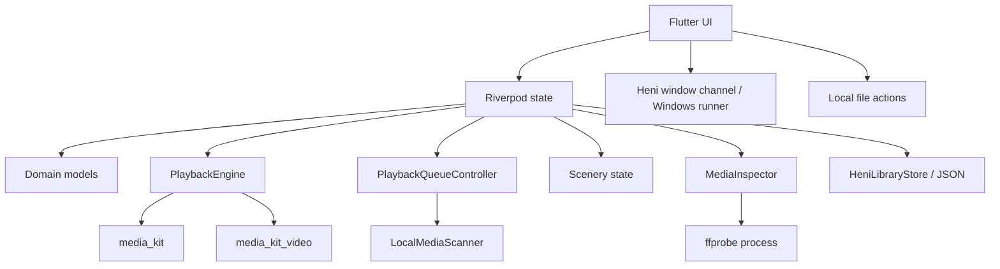

# Heni Architecture

Heni starts as a local player, but its structure leaves room for trimming,
transcoding, waveform extraction, and mobile/desktop platform differences.
The Windows player currently separates the library, browsed playlists, and the
active playback queue so browsing does not interrupt playback.

## Guiding Rules

1. Keep playback, media inspection, and UI state separate.
2. Prefer mature media engines over hand-written decoders.
3. Treat FFmpeg commands as structured argument lists, never shell strings.
4. Add persistence and editing tools only when the UI has a real need for them.

## Layers



## Package Shape

```text
lib/
  app/                 # App startup, router, top-level shell.
  design/              # Palettes, theme tokens, shared visuals.
  domain/              # Media, scenery, and theme value objects.
  features/            # User-facing slices.
  services/            # Playback and process-backed media tooling.
```

## Future Expansion Points

- Media library persistence can be added under `data/` with Drift/SQLite.
- The current Windows implementation starts with a small JSON store for library
  roots, imported file paths, playlist references, and scan settings.
- Editing can start with process-backed FFmpeg jobs before considering native
  bindings. The current player deliberately exposes no audio-export action.
- The Windows runner owns custom frame styling, hit testing, minimum size, and
  native window commands. Flutter owns the themed controls and drag regions.
- File-manager integration stays behind `LocalFileActions` instead of being
  assembled in presentation widgets.
- Android/iOS-specific storage permissions should stay in platform services,
  away from the playback screen.
- Platform progress is recorded in `logs/`, with Windows active and non-Windows
  targets paused for now.
