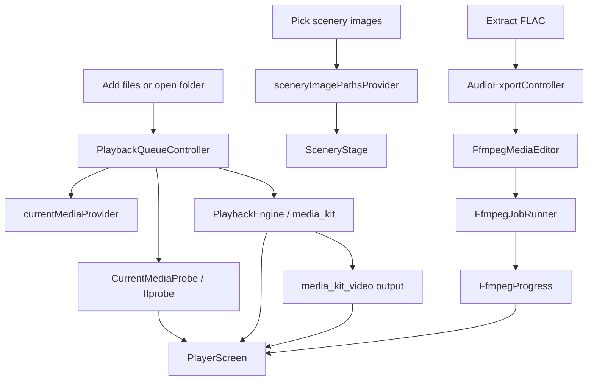

# Project Overview

Heni is currently a Windows-first Flutter desktop app. Android, iOS, macOS, and
Ubuntu/Linux are scaffolded but paused.

## Current Development Rule

Keep shared Dart code portable, but optimize decisions and verification for
Windows until the player, scenery surface, and media tooling are stable.

## Directory Map

```text
lib/
  main.dart
  app/
    heni_app.dart          # MaterialApp, theme, router wiring.
    router.dart            # Route table.
  design/
    app_theme.dart         # Theme palettes and theme construction.
  domain/
    media/                 # Media kind, item, ffprobe data models.
    scenery/               # Scenery pack model.
  features/
    player/
      application/         # Riverpod queue, settings, probe, export state.
      presentation/        # Player screen.
    scenery/
      presentation/        # Full-screen scenery stage.
  services/
    media/                 # PlaybackEngine and media_kit adapter.
    ffmpeg/                # ffprobe, FFmpeg commands, jobs, editor use cases.

docs/                      # Architecture and media-learning notes.
logs/                      # Platform progress logs.
test/services/ffmpeg/      # Media tooling tests.
windows/                   # Active platform template.
android/ ios/ macos/ linux/# Generated but paused platform templates.
```

## Main Runtime Flow



## Important Boundaries

- UI never builds FFmpeg shell strings.
- UI calls controllers/use cases and renders state.
- `FfmpegCommandBuilder` only returns `List<String>` arguments.
- `FfmpegJobRunner` owns process execution, progress, logs, timeout, and
  cancellation.
- `FfprobeMediaInspector` owns media metadata extraction.
- `PlaybackEngine` lets the app replace `media_kit` later if needed.
- `PlaybackQueueController` owns playlist, shuffle, repeat, folder scan settings,
  and automatic next-track behavior.

## Windows Commands

```powershell
flutter pub get
flutter analyze
flutter test
flutter run -d windows
flutter build windows --debug
flutter build windows --release
```

Release output:

```text
build/windows/x64/runner/Release/heni.exe
```

## Current Feature Surface

- Local audio/video picker.
- Local folder scanner.
- Local scenery image picker.
- In-memory playlists.
- Full-screen scenery background with fallback painting.
- Actual video output for video files.
- Palette switching.
- UI style switching: Scenery, Cinema, Library.
- Basic transport controls.
- Shuffle, repeat all, and repeat one.
- Progress slider.
- ffprobe media detail display.
- FLAC audio extraction with FFmpeg progress state.

## Near-Term Windows Focus

1. Manually test real playback and extraction.
2. Improve the player layout after seeing it in the running app.
3. Add media detail/debug panel for codec learning.
4. Add playlist rename/delete/reorder.
5. Persist theme, scenery, settings, and playlists.
