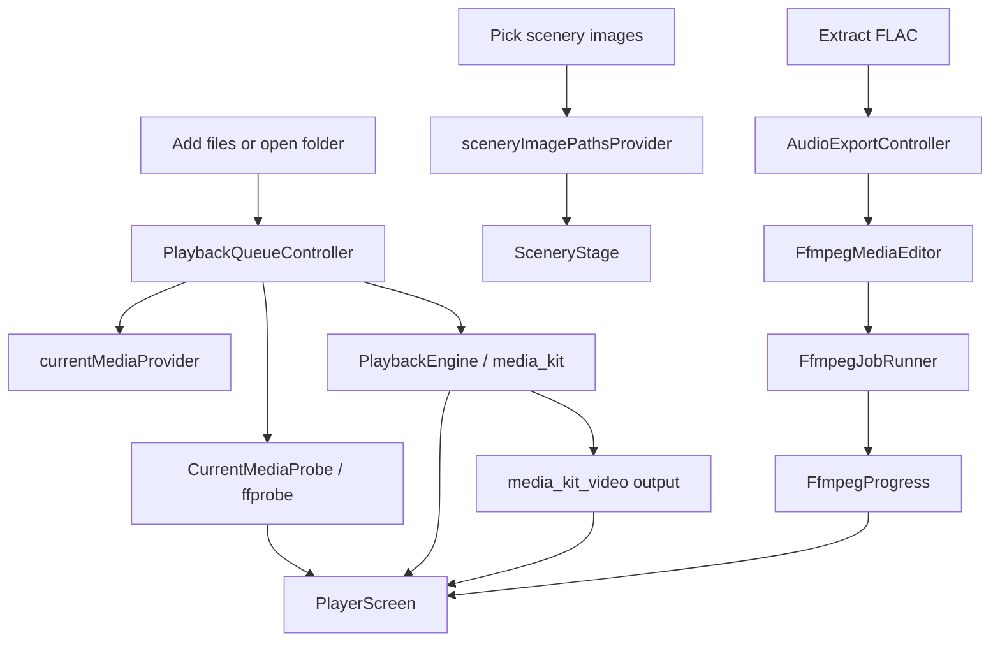

# Project Overview

Heni is currently a Windows-first Flutter desktop app. Android, iOS, macOS, and
Ubuntu/Linux are scaffolded but paused.

## Current Development Rule

Keep shared Dart code portable, but optimize decisions and verification for
Windows until the player, scenery surface, and media tooling are stable.

## Directory Map

```text
lib/
  main.dart
  app/
    heni_app.dart          # MaterialApp, theme, router wiring.
    router.dart            # Route table.
  design/
    app_theme.dart         # Theme palettes and theme construction.
  domain/
    media/                 # Media kind, item, ffprobe data models.
    scenery/               # Scenery pack model.
  features/
    player/
      application/         # Riverpod queue, settings, probe, export state.
      presentation/        # Player screen.
    scenery/
      presentation/        # Full-screen scenery stage.
  services/
    media/                 # PlaybackEngine and media_kit adapter.
    ffmpeg/                # ffprobe, FFmpeg commands, jobs, editor use cases.
    storage/               # Local JSON library and playlist persistence.

docs/                      # Architecture and media-learning notes.
logs/                      # Platform progress logs.
test/services/ffmpeg/      # Media tooling tests.
windows/                   # Active platform template.
android/ ios/ macos/ linux/# Generated but paused platform templates.
```

## Main Runtime Flow



## Important Boundaries

- UI never builds FFmpeg shell strings.
- UI calls controllers/use cases and renders state.
- `FfmpegCommandBuilder` only returns `List<String>` arguments.
- `FfmpegJobRunner` owns process execution, progress, logs, timeout, and
  cancellation.
- `FfprobeMediaInspector` owns media metadata extraction.
- `PlaybackEngine` lets the app replace `media_kit` later if needed.
- `PlaybackQueueController` owns the library, user playlists, the independent
  playback queue, playback modes, folder scan settings, and automatic
  next-track behavior.
- `HeniLibraryStore` persists library directories, manually added file paths,
  playlist path references, and scan settings in a small JSON file.

## Windows Commands

```powershell
flutter pub get
flutter analyze
flutter test
flutter run -d windows
flutter build windows --debug
flutter build windows --release
```

Release output:

```text
build/windows/x64/runner/Release/heni.exe
```

## Current Feature Surface

- Local audio/video picker.
- Local folder scanner.
- Local scenery image picker.
- Library that merges media from multiple folders and imported files.
- Playlists that reference library media paths without copying source files.
- Explicit "加入歌单" action in the library view for adding library media to
  user playlists.
- Playlist-page "从曲库添加" flow with search and multi-select bulk add.
- Playlist sidebar three-dot menu for add-from-library, rename, description,
  and delete actions.
- Local JSON config restore for library roots, file imports, playlists, and
  basic scan settings.
- Playlist browsing that does not interrupt the current playback queue.
- Desktop music-player layout:
  - Minimal top navigation with Heni, 美景/歌曲, centered palette selector, and
    settings.
  - Left playlist sidebar.
  - Top "歌曲" means the playlist/song-list view; left-side "曲库" is the
    built-in all-media collection.
  - Main playback/content area.
  - Bottom transport bar.
- Scenery background with fallback painting.
- Actual video output for video files.
- Compact top palette switching with solid color swatches, black/white choices,
  selected glow, and expanded preset themes.
- Active palette tinting across the top bar, sidebar, selected playlist rows,
  bottom bar, and utility controls.
- UI style switching: 美景, 歌曲.
- Chinese UI copy for the main Windows player.
- Unified typography preferring Microsoft YaHei.
- Basic transport controls.
- Previous/next controls backed by the current playback queue.
- Icon-only playback mode control: 顺序播放, 列表循环, 单曲循环, 随机播放.
- Progress slider.
- Speaker-only volume control with a bare palette-colored vertical slider that
  opens at the current cached volume.
- Cleaner bottom bar layout with now-playing, centered transport/progress, and
  right-side utility controls.
- Optional local lyric panel for same-name `.lrc` and `.txt` files.
- ffprobe media detail display.
- FLAC audio extraction with FFmpeg progress state.

## Near-Term Windows Focus

1. Manually test real playback and extraction.
2. Improve the player layout after seeing it in the running app.
3. Add media detail/debug panel for codec learning.
4. Add playlist reorder.
5. Persist theme and scenery pack.
