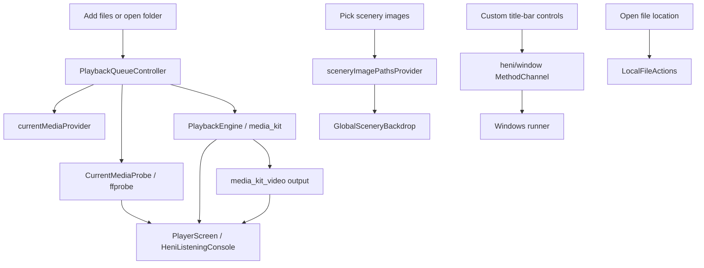

# Project Overview

Heni is currently a Windows-first Flutter desktop app. Android, iOS, macOS, and
Ubuntu/Linux are scaffolded but paused.

## Current Development Rule

Keep shared Dart code portable, but optimize decisions and verification for
Windows until the player, scenery surface, and media tooling are stable.

## Directory Map

```text
lib/
  main.dart
  app/
    heni_app.dart          # MaterialApp, theme, router wiring.
    router.dart            # Route table.
  design/
    app_theme.dart         # Theme palettes and theme construction.
  domain/
    media/                 # Media kind, item, ffprobe data models.
    scenery/               # Scenery pack model.
  features/
    player/
      application/         # Riverpod queue, settings, probe, sidebar state.
      presentation/        # Player shell, backdrop, console, progress, sidebar.
  services/
    files/                 # Reveal media in the platform file manager.
    media/                 # PlaybackEngine and media_kit adapter.
    ffmpeg/                # ffprobe plus retained low-level FFmpeg utilities.
    storage/               # Local JSON library and playlist persistence.
    window/                # Flutter-to-Windows custom frame channel.

docs/                      # Architecture and media-learning notes.
logs/                      # Platform progress logs.
test/services/ffmpeg/      # Media tooling tests.
windows/                   # Active platform template.
android/ ios/ macos/ linux/# Generated but paused platform templates.
```

## Main Runtime Flow



## Important Boundaries

- UI never builds FFmpeg shell strings.
- UI calls controllers/use cases and renders state.
- Retained FFmpeg utilities return structured `List<String>` arguments and own
  process execution details; they are not connected to a player export action.
- `FfprobeMediaInspector` owns media metadata extraction.
- `PlaybackEngine` lets the app replace `media_kit` later if needed.
- `PlaybackQueueController` owns the library, user playlists, the independent
  playback queue, playback modes, folder scan settings, and automatic
  next-track behavior.
- `HeniLibraryStore` persists library directories, manually added file paths,
  playlist path references, and scan settings in a small JSON file.

## Windows Commands

```powershell
flutter pub get
flutter analyze
flutter test
flutter run -d windows
flutter build windows --debug
flutter build windows --release
```

Release output:

```text
build/windows/x64/runner/Release/heni.exe
```

## Current Feature Surface

- Local audio/video picker.
- Local folder scanner.
- Local scenery image picker.
- Library that merges media from multiple folders and imported files.
- Playlists that reference library media paths without copying source files.
- Explicit "加入歌单" action in the library view for adding library media to
  user playlists.
- Playlist-page "从曲库添加" flow with search and multi-select bulk add.
- Playlist sidebar three-dot menu for add-from-library, rename, description,
  and delete actions.
- Local JSON config restore for library roots, file imports, playlists, and
  basic scan settings.
- Playlist browsing that does not interrupt the current playback queue.
- Desktop music-player layout:
  - Themed custom Windows frame with drag, minimize, maximize/restore, and
    close controls.
  - Global search and palette controls in the top work bar.
  - Expanded labeled sidebar with an explicit compact rail; narrow windows
    force compact mode with resize hysteresis.
  - Main playback/list workspace and a fixed bottom transport dock.
- Full-window scenery background with stronger playback treatment, quieter
  library treatment, and fallback painting.
- Actual video output for video files.
- Compact top palette switching with solid color swatches, black/white choices,
  selected glow, and expanded preset themes.
- Active palette tinting across the top bar, sidebar, selected playlist rows,
  bottom bar, and utility controls.
- UI style switching: 美景, 歌曲.
- Chinese UI copy for the main Windows player.
- Unified typography preferring Microsoft YaHei.
- Basic transport controls.
- Previous/next controls backed by the current playback queue.
- Icon-only playback mode control: 顺序播放, 列表循环, 单曲循环, 随机播放.
- Progress slider.
- Speaker-only volume control with a bare palette-colored vertical slider that
  opens at the current cached volume.
- Cleaner bottom bar layout with now-playing, centered transport/progress, and
  right-side utility controls.
- Responsive progress display that preserves seeking and hides time labels
  before they collide.
- Listening console with current media, source path, ffprobe codec/bitrate/
  sample-rate/channels, next track, queue location, and file location.
- Playback-queue dialog that automatically locates the current track and
  remains scrollable at the minimum window height.
- No lyric surface and no user-facing FLAC/audio export.

## Near-Term Windows Focus

1. Run Release playback coverage across representative source codecs.
2. Add audio-output diagnostics only if Windows output/resampling questions
   require them.
3. Add playlist reorder.
4. Add configurable `ffprobe` discovery.
